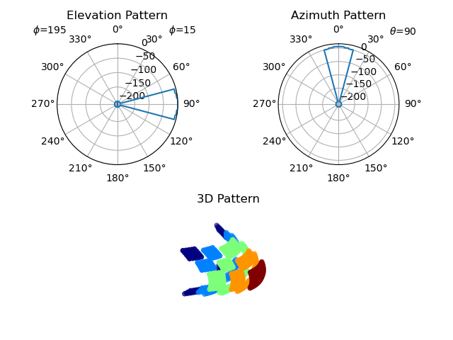

emane-antenna-simple-viewer
==

Simple EMANE antenna and blockage pattern 2D/3D rendering tools using
[Mayavi][1] and [Matplotlib][2].

```
$ emane-antenna-simple-viewer-3d antenna30dsector.xml
$ emane-antenna-simple-viewer-2d3d antenna30dsector.xml
```



[1]: http://docs.enthought.com/mayavi/mayavi
[2]: https://matplotlib.org

